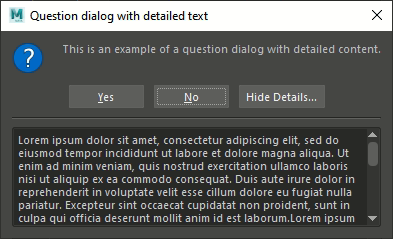
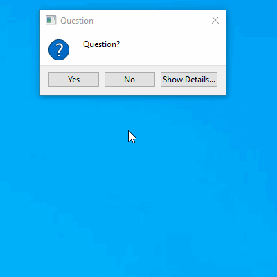
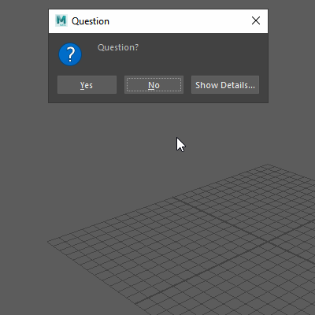

# Python Qt Resizable Message Box

## Description

Message Box dialogs in Qt are not resizable.
They automatically fit to the size of their content, which in general is exactly what is desired.

However, in some cases, the ability to resize the dialog is required: typically when using the "detailed text" feature of the message box.
The detailed text can be quite long, and is displayed in a scroll area in the dialog. The length of the text is not influencing the size of the dialog, often resulting in a long text displayed in a small viewing area with scrollbars.




The expected solution would be to simply allow resizing by calling the method:
```python
QtWidgets.QDialog.setSizeGripEnabled(bool_arg)
```
However, this doesn't work: the "size grip" is present, but the dialog window still can't be resized.


The proposed solution is inspired from a reply on a thread on the [QtCentre forum](https://www.qtcentre.org/forum.php).
The [reply](https://www.qtcentre.org/threads/24888-Resizing-a-QMessageBox?p=135851#post135851) in the thread [Resizing a QMessageBox?](https://www.qtcentre.org/threads/24888-Resizing-a-QMessageBox) suggests a "really nasty hack" to solve the problem, by overriding the 'event' function of the QmessageBox class.

However, some changes have been made in order to make it less a "nasty hack" (besides of course the "translation" from C++ to Python):
- Instead of overriding the general event handler method, it is preferable to override the 'resizeEvent' method, as it will only be executed on resize related events.
- Having the size grip always present isn't ideal, as there is no reason to resize the dialog window when the detailed text is not shown.
- The code allowing the resizing is only executed when the size grip is present.
- The minimum size of the widget is not modified, as it shouldn't be allowed to get smaller than the original dialog size.


## Examples

Here are 2 examples of the Resizable Message Box in action.
The first one is in a standard Python application, the second one is inside a Maya 2020 session.






## Files

* **resizable_messagebox.py**: The core of the project, containing the class definition of the Resizable Message Box
* [extras]
    * **Qt.py**: The [Qt.py](#qtpy) file allowing to use the different Qt Python bindings
    * **dialogs.py**: An example file showing how to define common message box types using the Resizable Message Box
    * **usage.py**: An example file showing how to use the message boxes
    * **usage_maya.py**: An example file showing how to use the message boxes in Maya


### Qt.py

*Qt.py enables you to write software that runs on any of the 4 supported bindings - PySide2, PyQt5, PySide and PyQt4.*

Use of [Qt.py](https://github.com/mottosso/Qt.py) from [Marcus Ottosson](https://github.com/mottosso), allowing to use any Qt Python binding instead of only PyQt4.

The Qt.py file must be located in one of the defined Python paths.
The provided version of Qt.py can be used.


## Remarks

### Qt.py doesn't replace Qt
Qt and one of the Python bindings need to be installed on the system, and accessible from the Python session.

In Maya: Qt and its PySide bindings are included in the installation, hence don't need to be installed separately.

### Python version
The project was written in Python 2.7 (as used by Maya 2020), but should work with any version of Python post 2.7.
The code has been tested in Maya 2019 and 2020, as well as standalone in Python 2.7.16 and 3.7.9.